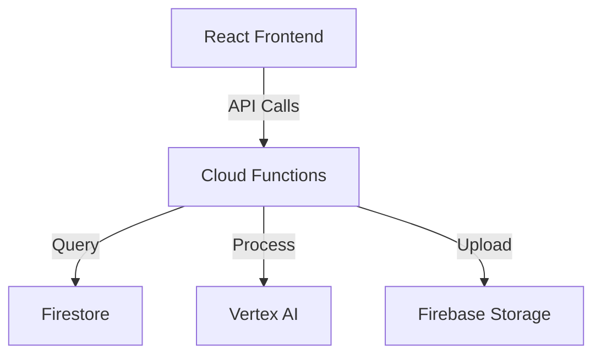

# Diagrams & Architecture

Visual documentation and architecture diagrams.

## Contents

- **SYSTEM_ARCHITECTURE.md** - Overall system architecture diagram
- **DATA_FLOW.md** - Data flow between components
- **DATABASE_SCHEMA.md** - Firestore collection schema
- **DEPLOYMENT_ARCHITECTURE.md** - Production deployment diagram
- **API_FLOW.md** - API request/response flows

## Tools Recommended

- Draw.io for creating diagrams
- Mermaid for text-based diagrams
- PlantUML for UML diagrams

## Diagram Formats

- `.drawio` - Draw.io files (editable)
- `.png` - PNG exports for documentation
- `.md` - Mermaid/text-based diagrams embedded in markdown

## Example Mermaid Diagram

